## Optimizing Go Programs

This is a collation of tools and techniques that will help optimize Go programs.  It is divided into two parts - Tools and Techniques.  Tools look at the go command line tools that help you instrument your code.  Techniques look at a list of ideas that you could potentially use to gain performance.  

At the end are also a large list of references of the posts that I went through to understand it myself.  I have personally worked on, reworked, tried, and tested all the code (from about April 2019 to June 2019 - so far).  However, as the large list of references show, I am indebted to others.  I have often liberally adopted and adapted their thoughts and, occasionally, their notes.

## Go Tools for Optimization
* [Testing](#testing)
* [Coverage](#coverage)
* [Benchmarking](#benchmarking)
* [Profiling](#profiling)
* [Tracing](#tracing)
	- how to read the views
	- tagging sections
* environment variables
	- [GOMAXPROCS](#gomaxprocs)
	- [GOGC](#gogc)
* go memory analysis
	- [stack and heap](#stack-and-heap)
	- [escape analysis](#escape-analysis)
* [Inlining](#inlining)

## Go Techniques for Optimization
* [Parallelize CPU Work](#parallelize-cpu-work)
* [Bounds Check Elimination](#bounds-check-elimination)
* [sync Pools](#syncpools)
* [sync once and lazy initializations](#synconce-for-lazy-initialization)
* [Arrays and Slices](#arrays-and-slices)
	- how do slices work internally. allocation and reuse.
* [String Concatenation](#string-concatenation)
* [Map Keys: int vs string](#map-keys-int-vs-string)
* [JSON Unmarshaling](#json-unmarshaling)
* [File I/O](#file-io)
* [Regexp Compilation](#regexp-compilation)
* [Defer](#defer)
* [fmt vs strconv](#fmt-vs-strconv)
* [Explicitly Set Derived Values](#explicitly-set-derived-values)

* [Go Performance Patterns](#go-performance-patterns)

## Testing

*What do we need?* The ability to validate and verify our code (before customers test it).

Unit testing is important enough to be a standard library.

To write tests in Go:
* the file name must end in ```_test.go```
* the test function should start with ```Test```
* the function signature is ```func Test_someFn(t *testing.T) { ... }```


```code/testing```

```
func BeginsWith(s, pat string) bool {
	return strings.HasPrefix(s, pat)
}

func Test_BeginsWith(t *testing.T) {
	tc := []struct {
		s, pat string
		exp    bool
	}{
		{"GoLang", "Go", true},
		{"GoLang", "Java", false},
		{"GoLang is awesome", "awe", false},
		{"awesome is GoLang. - Yoda", "awe", true},
	}

	for _, tt := range tc {
		if BeginsWith(tt.s, tt.pat) != tt.exp {
			t.Fail()
		}
	}
}
```

```
$ go test -v
=== RUN   Test_BeginsWith
--- PASS: Test_BeginsWith (0.00s)
PASS
```

Testing validates your code.  It checks for correctness.

```Tip: unit testing first, always.```
```Tip: keep unit testing running and watching for file changes. (see, codeskyblue/fswatch)```

p.s. When you run benchmarks, tests are run first.

## Coverage

*What do we need?* So we've written tests, but does it cover all our code?

The Go tooling also gives you coverage results.  Less code is faster code.  Tested and covered code is more reliable code.

```code/cover```

```
go test -covermode=count -coverprofile=count.out fmt
go tool cover -html=count.out
```

Red areas have had zero coverage.  The brighter green sections have been covered more than the duller green sections.

For current folder:
```
go test -covermode=count -coverprofile=count.out
go tool cover -html=count.out
```

```Tip: Keep coverage as a check-in metric objective.  Or at least track coverage history in your build tool.```

## Benchmarking

*What do we need?* The ability to instrument specific functions and see where it is spending time or allocating resources.

Benchmarking checks for optimization.

```code/testing```

```
func Benchmark_BeginsWith(b *testing.B) {
	for i := 0; i < b.N; i++ {
		BeginsWith("GoLang", "Go")
	}
}
```

```
$ go test -v -bench=. -benchmem
=== RUN   Test_BeginsWith
--- PASS: Test_BeginsWith (0.00s)
goos: darwin
goarch: amd64
Benchmark_BeginsWith-8   	500000000	         3.69 ns/op	       0 B/op	       0 allocs/op
PASS
```

Benchmarking functions don't always care about the result (that is checked by unit testing).  However, the speed/allocations/blocking of a function could be dependent on the inputs - so test different inputs. 

```Tip: Map optimization goals to business SLOs and SLAs.```

### Benchcmp

Use benchcmp to easily compare between benchmarks.

```
$ go test -run=NONE -bench=. ./... > old.txt
// make changes
$ go test -run=NONE -bench=. ./... > new.txt

$ benchcmp old.txt new.txt

benchmark           old ns/op     new ns/op     delta
BenchmarkConcat     523           68.6          -86.88%

benchmark           old allocs     new allocs     delta
BenchmarkConcat     3              1              -66.67%

benchmark           old bytes     new bytes     delta
BenchmarkConcat     80            48            -40.00%
```

## Profiling

*What do we need?* The ability to instrument and analyze execution metrics.

Package pprof writes runtime profiling data in the format expected by the pprof visualization tool.

The first step to profiling a Go program is to enable profiling. Support for profiling benchmarks built with the standard testing package is built into go test.

```
func isGopher(email string) (string, bool) {
	re := regexp.MustCompile("^([[:alpha:]]+)@golang.org$")
	match := re.FindStringSubmatch(email)
	if len(match) == 2 {
		return match[1], true
	}
	return "", false
}

func Benchmark_isGopher(b *testing.B) {

	tcs := []struct {
		in    string
		exp   bool
		expId string
	}{
		{
			"a@golang.org",
			true,
			"a",
		},
	}

	for i := 0; i < b.N; i++ {
		isGopher(tcs[0].in)
	}
}
```

```
go test -bench=. -cpuprofile=cpu.pprof

go tool pprof cpu.pprof

go-torch --binaryname web.test -b cpu.pprof
open torch.svg
```

More recently (1.10?), pprof got its own UI.

```
$ go get github.com/google/pprof
```

The tool launches a web UI if -http flag is provided. For example, in order to launch the UI with an existing profile data, run the following command:


```
pprof -http=:8080 cpu.pprof
```

There is also a standard HTTP interface to profiling data. Adding the following line will install handlers under the /debug/pprof/ URL to download live profiles:

```
import _ "net/http/pprof"
See the net/http/pprof package for more details.
```

## M, P, G

*Question*: How does concurrency work in Go?  How is it different from threads?

OS Layout

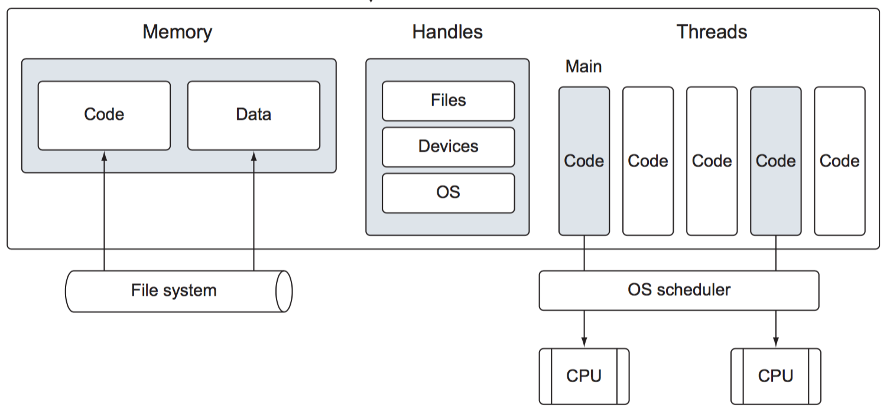

Goroutines on a Thread

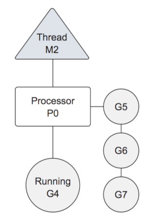

Goroutines on Blocking Thread

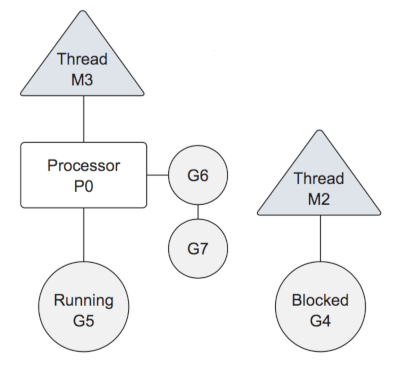

Concurrency and Parallelism

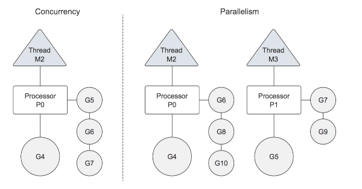

## Tracing

https://blog.gopheracademy.com/advent-2017/go-execution-tracer/

Ever wondered how are your goroutines being scheduled by the go runtime? Ever tried to understand why adding concurrency to your program has not given it better performance? The go execution tracer can help answer these and other questions to help you diagnose performance issues, e.g, latency, contention and poor parallelization.

Data is collected by the tracer without any kind of aggregation or sampling. In some busy applications this may result in a large file.

While the CPU profiler does a nice job to telling you what function is spending most CPU time, it does not help you figure out what is preventing a goroutine from running or how are the goroutines being scheduled on the available OS threads. That’s precisely where the tracer really shines.

### Ways to get a Trace

* Using the runtime/trace pkg
This involved calling trace.Start and trace.Stop and was covered in our “Hello, Tracing” example.

* Using -trace=<file> test flag
This is useful to collect trace information about code being tested and the test itself.

```code/tracing```
```
go test -trace=a.out && go tool trace a.out
```

* Using debug/pprof/trace handler
This is the best method to collect tracing from a running web application.

### View Trace

```
go tool trace trace_file.out
```


1. Timeline
Shows the time during the execution and the units of time may change depending on the navigation. One can navigate the timeline by using keyboard shortcuts (WASD keys, just like video games).
2. Heap
Shows memory allocations during the execution, this can be really useful to find memory leaks and to check how much memory the garbage collection is being able to free at each run.
3. Goroutines
Shows how many goroutines are running and how many are runnable (waiting to be scheduled) at each point in time. A high number of runnable goroutines may indicate scheduling contention, e.g, when the program creates too many goroutines and is causing the scheduler to work too hard.
4. OS Threads
Shows how many OS threads are being used and how many are blocked by syscalls.
5. Virtual Processors
Shows a line for each virtual processor. The number of virtual processors is controlled by the GOMAXPROCS environment variable (defaulting to the number of cores).
6. Goroutines and events
Displays where/what goroutine is running on each virtual processor. Lines connecting goroutines represent events. In the example image, we can see that the goroutine “G1 runtime.main” spawned two different goroutines: G6 and G5 (the former is the goroutine responsible for collecting the trace data and the latter is the one we started using the “go” keyword).
A second row per processor may show additional events such as syscalls and runtime events. This also includes some work that the goroutine does on behalf of the runtime (e.g assisting the garbage collector).


### View Goroutine


This information includes:

* Its “name” (Title)
* When it started (Start)
* Its duration (Wall Duration)
* The stack trace when it started
* The stack trace when it finished
* Events generated by this goroutine

### Tracing Example

```code/tracing```

```
func main() {
	f, _ := os.OpenFile(version+".trace", os.O_CREATE|os.O_TRUNC|os.O_WRONLY, 0644)
	trace.Start(f)
	defer trace.Stop()

	mergesortv1(s)

}

```

```
go run mergesort.go v1 && go tool trace v1.trace
```

### Tracing GC

The trace tool gives you a very good view into when the GC kicks in, when it is run, and how you could potentially optimize for it.

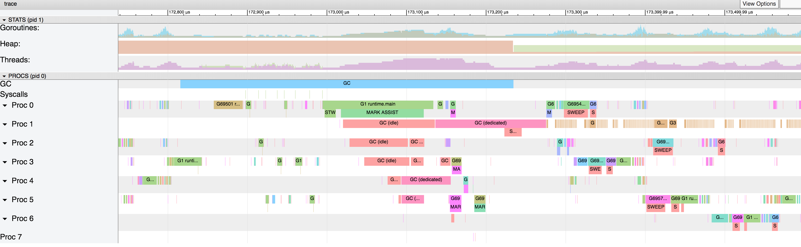

### Tracing Conclusion
The tracer is a powerful tool for debugging concurrency issues, e.g, contentions and logical races. But it does not solve all problems: it is not the best tool available to track down what piece of code is spending most CPU time or allocations. The go tool pprof is better suited for these use cases.

The tool really shines when you want to understand the behavior of a program over time and to know what each goroutine is doing when NOT running. Collecting traces may have some overhead and can generate a high amount of data to be inspected.

## GOMAXPROCS

Discussion: for a program to be more efficient should you have more threads/goroutines or less?

Discussion: goroutines are kinda sorta similar to threads.  So why don't we just use threads instead of goroutines?

Threads typically take up more resources than goroutines - a minimum thread stack typically is upwards of 1MB.
A goroutine typically starts of at 2kb.  So, that's, at a very minimum, a reduction of 500x.  Anything else though?

Context switching in Linux is about 1000ns while in go it is about 200ns - https://eli.thegreenplace.net/2018/measuring-context-switching-and-memory-overheads-for-linux-threads/

A primary cost factor is contention.  Programs that has parallelism does not necessarily have higher performance because of greater contention for resources.

### What is GOMAXPROCS?
The GOMAXPROCS setting controls how many operating systems threads attempt to execute code simultaneously.  For example, if GOMAXPROCS is 4, then the program will only execute code on 4 operating system threads at once, even if there are 1000 goroutines. The limit does not count threads blocked in system calls such as I/O.

GOMAXPROCS can be set explicitly using the GOMAXPROCS environment variable or by calling runtime.GOMAXPROCS from within a program.

```code/gomaxprocs```

```
func main() {
	fmt.Println("runtime.NumCPU()=", runtime.NumCPU())
}
```

On my quad-core CPU it prints:
```
runtime.NumCPU()= 8
```

Why is it showing 8 for NumCPU for a quad-core machine? The Intel chips on my machine is hyperthreaded - for each processor core that is physically present, the operating system addresses two virtual (logical) cores and shares the workload between them when possible.

### What should be the value of GOMAXPROCS?

The default setting of GOMAXPROCS in all Go releases [up to 1.4] is 1, because programs with frequent goroutine switches ran much slower when using multiple threads. It is much cheaper to switch between two goroutines in the same thread than to switch between two goroutines in different threads.

Goroutine scheduling affinity and other improvements to the scheduler have largely addressed the problem, by keeping goroutines that are concurrent but not parallel in the same thread.

For Go 1.5, the default setting of GOMAXPROCS to the number of CPUs available, as determined by runtime.NumCPU.

### Running with different GOMAXPROCS

```
GOMAXPROCS=1 go run mergesort.go v1 & go tool trace v1.trace
```

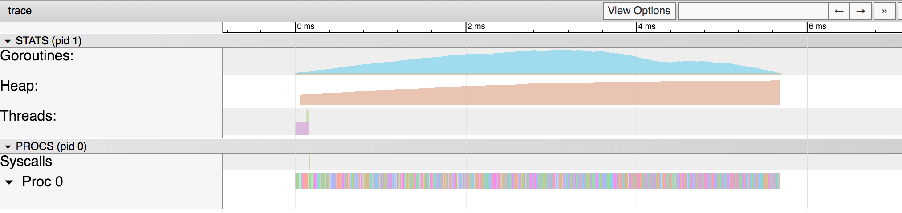

```
GOMAXPROCS=8 go run mergesort.go v1 & go tool trace v1.trace
```

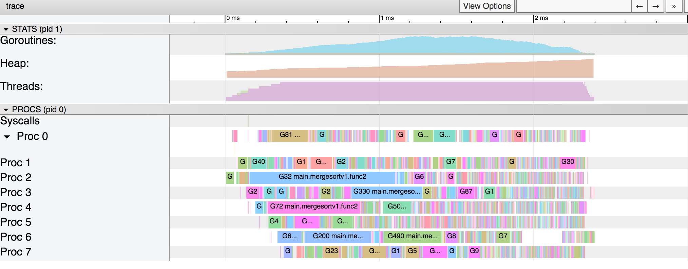

```
GOMAXPROCS=18 go run mergesort.go v1 & go tool trace v1.trace
```

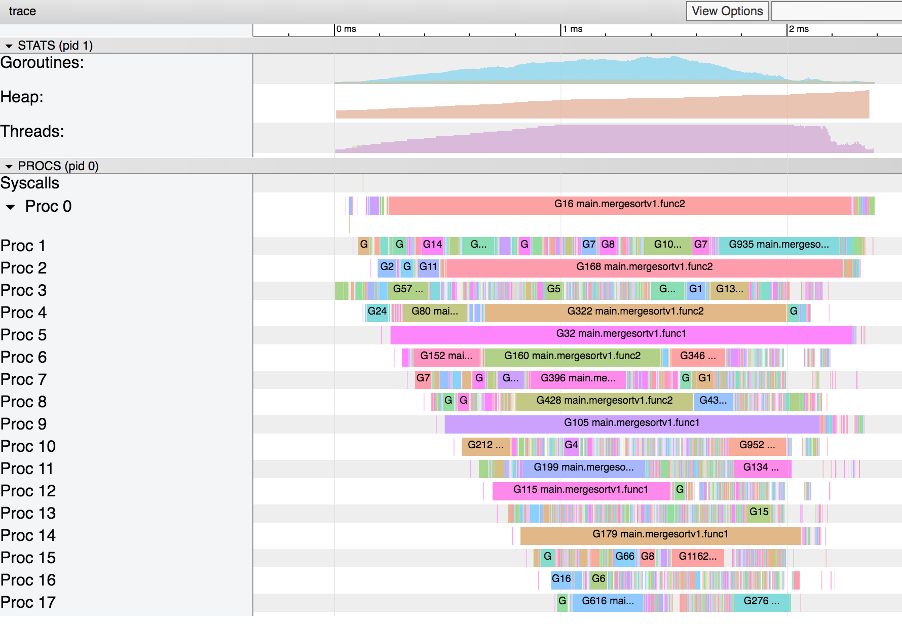

The number is the max possible and it is not required that the Go runtime create as many logical processors as you have specified.  

### Exercise
```gocode/gomaxprocs```

Run the following and see the differences in the trace.

```
GOMAXPROCS=1 go run mergesort.go v2 && go tool trace v2.trace
GOMAXPROCS=8 go run mergesort.go v2 && go tool trace v2.trace
GOMAXPROCS=18 go run mergesort.go v2 && go tool trace v2.trace

GOMAXPROCS=1 go run mergesort.go v3 && go tool trace v3.trace
GOMAXPROCS=8 go run mergesort.go v3 && go tool trace v3.trace
GOMAXPROCS=18 go run mergesort.go v3 && go tool trace v3.trace
```

```Opt Tip: Do not assume that increasing the number of GOMAXPROCS always improves speed.```

## GOGC

*Question:* If GC is so important, can we adjust GC parameters?  Can we change the GC algorithm?

The GOGC variable sets the initial garbage collection target percentage. A collection is triggered when the ratio of freshly allocated data to live data remaining after the previous collection reaches this percentage. The default is GOGC=100. Setting GOGC=off disables the garbage collector entirely. The runtime/debug package's SetGCPercent function allows changing this percentage at run time. 

GOGC controls the aggressiveness of the garbage collector.

Setting this value higher, say GOGC=200, will delay the start of a garbage collection cycle until the live heap has grown to 200% of the previous size. Setting the value lower, say GOGC=20 will cause the garbage collector to be triggered more often as less new data can be allocated on the heap before triggering a collection.

With the introduction of the low latency collector in Go 1.5, phrases like “trigger a garbage collection cycle” become more fluid, but the underlying message that values of GOGC greater than 100 mean the garbage collector will run less often, and for values of GOGC less than 100, more often


### Exercise
```gocode/gogc```

Run the following and see the differences in the trace for heap and GC.

```
GOGC=off go run mergesort.go v1 & go tool trace v1.trace
GOGC=50 go run mergesort.go v1 & go tool trace v1.trace
GOGC=100 go run mergesort.go v1 & go tool trace v1.trace
GOGC=200 go run mergesort.go v1 & go tool trace v1.trace
```

GOGC=off
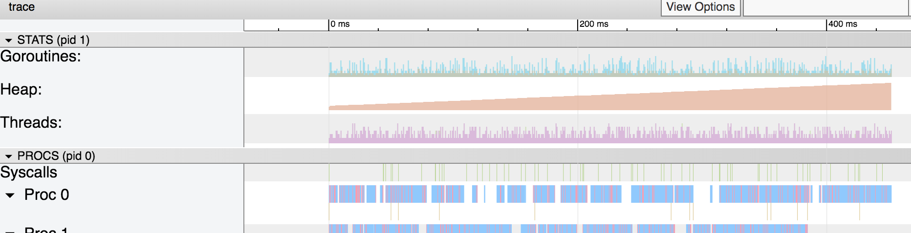

GOGC=50
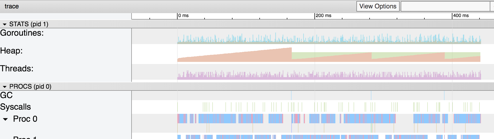

GOGC=100
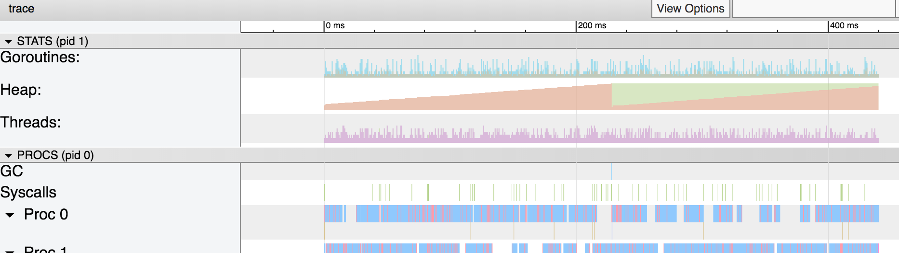

GOGC=200
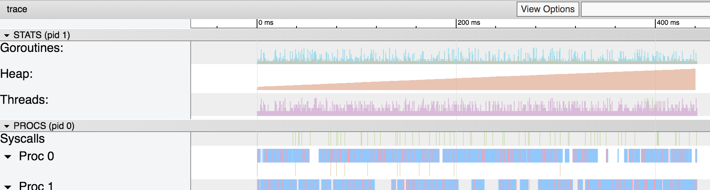

```Opt Tip: This helps you analyze your GC patterns but I can't find any posts that recommend this as a good performance tuning strategy.```


## Stack and Heap

*Discussion:* where is the stack memory shown in a trace diagram? Is knowing stack and heap allocation important? How about in languages like Python, Java, JavaScript, etc.?

ref: https://scvalex.net/posts/29/

### Stack Frame
ref: http://www.cs.uwm.edu/classes/cs315/Bacon/Lecture/HTML/ch10s07.html

The stack frame, also known as activation record is the collection of all data on the stack associated with one subprogram call.

The stack frame generally includes the following components:

* The return address
* Argument variables passed on the stack
* Local variables (in HLLs)
* Saved copies of any registers modified by the subprogram that need to be restored

 The Stack
 ---------

```
|      f()      |
|               |
+---------------+
|  func f(){    |  \
|       g()     |   } Stack frame of calling function f()
|  }            |  /
+---------------+
|  func g() {   |  \
|     a := 10   |   } Stack frame of called function: g()
|  }            |  /
+---------------+
================= // invalid below this
```

As the function call returns, the stack unwinds leaving previous stack frames invalid.

```
|      f()      |
|               |
+---------------+
|  func f(){    |  \
|       g()     |   } Stack frame of calling function f()
|  }            |  /
+---------------+
================= // invalid below this
|  func g() {   |  \
|     a := 10   |   } Stack frame of called function: g()
|               |  /
+---------------+
```

All local variables are no more accessible.  In C, returning a pointer to a local variable would cause a segmentation fault.

```
// online c editor - https://onlinegdb.com/HySykSJoE

#include <stdio.h>

int* f() {
    int a;
    a = 10;
    return &a;
}

void main()
{
    int* p = f();
    printf("p is: %x\n", p);   // p is 0
    printf("*p is: %d\n", *p); // segmentation fault

	// 
}
```

## Escape Analysis

In C, returning the reference of a local variable causes a segfault because that memory is no more valid.

```
// online c editor - https://onlinegdb.com/HySykSJoE

#include <stdio.h>

int* f() {
    int a;
    a = 10;
    return &a;
}

void main()
{
    int* p = f();
    printf("p is: %x\n", p);   // p is 0
    printf("*p is: %d\n", *p); // segmentation fault

	//
}
```

In Go, it is allowed to return the reference of a local variable.  

```
package main

import (
	"fmt"
)

func f() *int {
	x := 10
	return &x
}

func main() {
	fmt.Println(*f()) // prints 10
}
```

How is that possible?

From Effective Go: "Note that, unlike in C, it’s perfectly OK to return the address of a local variable; the storage associated with the variable survives after the function returns."

"When possible, the Go compilers will allocate variables that are local to a function in that function’s stack frame. However, if the compiler cannot prove that the variable is not referenced after the function returns, then the compiler must allocate the variable on the garbage-collected heap to avoid dangling pointer errors. In the current compilers, if a variable has its address taken, that variable is a candidate for allocation on the heap. However, a basic escape analysis recognizes some cases when such variables will not live past the return from the function and can reside on the stack."

*Can we figure out when variables escape to the heap?*

```
// go build -gcflags='-m' 1.go
// go build -gcflags='-m -l' 1.go to avoid inlining
// go build -gcflags='-m -l -m' 1.go for verbose comments.
```

```
func f() {
	var i = 5
	i++
	_ = i
}

func main() {
	f()
}
```

```
$ go build -gcflags='-m -l -m' 1.go
// returns nothing.
```

```
func f_returns() int {
	var i = 5
	i++
	return i
}

func main() {
	f_returns()
}
```

```
$ go build -gcflags='-m -l -m' 1.go
// returns nothing.
```

```
func f_returns_ptr() *int {
	var i = 5
	i++
	return &i
}

func main() {
	f_returns_ptr()
}
```

```
$ go build -gcflags='-m -l -m' 1.go
# command-line-arguments
./1.go:24:9: &i escapes to heap
./1.go:24:9: 	from ~r0 (return) at ./1.go:24:2
./1.go:22:6: moved to heap:
```

Once the variable is on the heap, there is pressure on the Garbage Collector.

Garbage collection is a convenient feature of Go - automatic memory management makes code cleaner and memory leaks less likely. However, GC also adds overhead as the program periodically needs to stop and collect unused objects. The Go compiler is smart enough to automatically decide whether a variable should be allocated on the heap, where it will later need to be garbage collected, or whether it can be allocated as part of the stack frame of the function which declared it. Stack-allocated variables, unlike heap-allocated variables, don’t incur any GC overhead because they’re destroyed when the rest of the stack frame is destroyed - when the function returns.

To perform escape analysis, Go builds a graph of function calls at compile time, and traces the flow of input arguments and return values.

However, if there are variables to be shared, it is appropriate for it to be on the heap.

```Tip: If you’ve profiled your program’s heap usage and need to reduce GC time, there may be some wins from moving frequently allocated variables off the heap. ```

See: https://segment.com/blog/allocation-efficiency-in-high-performance-go-services/
See: http://www.agardner.me/golang/garbage/collection/gc/escape/analysis/2015/10/18/go-escape-analysis.html


## Inlining

"By default, the inliner will try to inline leaf function (doesn't call other functions/method/interfaces) that doesn't call panic or recover or select or switch or create closure or go/defer functions (see example below) and which is less than 40 nodes when represented (roughly corresponding to 40 simple operations). But please beware that this only describes the current status quo of the gc compiler, and it will surely improve in the future. Thus please try not to depend on this."

Inlining is done by the compiler automatically and there is no way to indicate that the piece of code should be inlined.  Sometimes, your performance benchmarks might look suspiciously skewed because the code has been inlined.  Then use the ```-gcflags="-m"``` option to see if the compiler has inlined your code.
```
// code/inline/inline.go
package main

import "fmt"

func f() int {
	return 2
}

func main() {
	x := f()
	fmt.Println(x)
}
```

```
$ go build -gcflags="-m" inline.go
# command-line-arguments
./inline.go:5:6: can inline f
./inline.go:9:6: can inline main
./inline.go:10:8: inlining call to f
./inline.go:11:13: inlining call to fmt.Println
./inline.go:11:13: x escapes to heap
./inline.go:11:13: io.Writer(os.Stdout) escapes to heap
./inline.go:11:13: main []interface {} literal does not escape
<autogenerated>:1: os.(*File).close .this does not escape
```


## Parallelize CPU work
When the work can be parallelized without too much synchronization, taking advantage of all available cores can speed up execution linearly to the number of physical cores.

```code/parallelize/rand_strings_test.go```

```
var letters = []rune("abcdefghijklmnopqrstuvwxyzABCDEFGHIJKLMNOPQRSTUVWXYZ")

func RandString(n int) string {
	b := make([]rune, n)
	for i := range b {
		b[i] = letters[rand.Intn(len(letters))]
	}
	time.Sleep(10 * time.Microsecond)
	return string(b)
}

func RandString_Sequential() {
	for i := 0; i < 1000; i++ {
		s = append(s, RandString(100))
	}
}

func RandString_Concurrent() {
	for i := 0; i < 1000; i++ {
		go func() {
			s = append(s, RandString(100))
		}()
	}
}

```

```
$ go test -bench=Sequential rand_strings_test.go
Benchmark_Concurrent-8   	     200	   26,936,125 ns/op
```

```
$ go test -bench=Concurrent rand_strings_test.go
Benchmark_Concurrent-8   	      50	    9,422,900 ns/op
```

Running the code concurrently has given you a 3x performance improvement.

Now run it with the //time.Sleep commented out.

```
$ go test -bench=Sequential rand_strings_test.go
Benchmark_Sequential-8   	     500	   3,865,565 ns/op
```

```
ok  	command-line-arguments	2.354s
$ go test -bench=Concurrent rand_strings_test.go
Benchmark_Concurrent-8   	     200	   9,539,612 ns/op
ok  	command-line-arguments	2.991s
```

Now we see a 3x drop in performance!

Consider tight loops.  Tight loops do not allow the runtime scheduler to schedule goroutines efficiently.

But consider contention.  If concurrent lines of work are stuck waiting for common resources, you're going to have worse performance.

```Tip: Concurrency is good.  But have 'mechanical sympathy'.```


## Bounds Check Elimination

Let's compare what the compiled output of these two fairly similar programs are.

```
// a.go
3 func a(a []int) {
4	n := 6
5	_ = a[n]
6 }
```

```
// b.go
3 func b(b [5]int) {
4	n := len(b) - 1
5	_ = b[n]
6 }
```

```
$ go tool compile -S a.go > a.co
$ go tool compile -S b.go > b.co
$ vimdiff a.co b.co
```

```
"".a STEXT nosplit size=39 args=0x18 locals=0x8
	(a.go:3)	TEXT	"".a(SB), NOSPLIT|ABIInternal, $8-24
	(a.go:3)	SUBQ	$8, SP
	(a.go:3)	MOVQ	BP, (SP)
	(a.go:3)	LEAQ	(SP), BP
	(a.go:3)	FUNCDATA	$0, gclocals·1a65...
	(a.go:3)	FUNCDATA	$1, gclocals·69c1...
	(a.go:3)	FUNCDATA	$3, gclocals·33cd...
	(a.go:5)	PCDATA	$2, $0
	(a.go:5)	PCDATA	$0, $1
	(a.go:5)	MOVQ	"".a+24(SP), AX
	(a.go:5)	CMPQ	AX, $6
	(a.go:5)	JLS	32
	(a.go:6)	PCDATA	$2, $-2
	(a.go:6)	PCDATA	$0, $-2
	(a.go:6)	MOVQ	(SP), BP
	(a.go:6)	ADDQ	$8, SP
	(a.go:6)	RET
	(a.go:5)	PCDATA	$2, $0
	(a.go:5)	PCDATA	$0, $1
	(a.go:5)	CALL	runtime.panicindex(SB)
	(a.go:5)	UNDEF
	0x0000 48 83 ec 08 48 89 2c 24 48 8d 2c 24 48 8b 44 24  H...H.,$H.,$H.D$
	0x0010 18 48 83 f8 06 76 09 48 8b 2c 24 48 83 c4 08 c3  .H...v.H.,$H....
	0x0020 e8 00 00 00 00 0f 0b                             .......
	rel 33+4 t=8 runtime.panicindex+0
```

```
// b.co
"".b STEXT nosplit size=1 args=0x28 locals=0x0
	(b.go:3)	TEXT	"".b(SB), NOSPLIT|ABIInternal, $0-40
	(b.go:3)	FUNCDATA	$0, gclocals·33cd...
	(b.go:3)	FUNCDATA	$1, gclocals·33cd...
	(b.go:3)	FUNCDATA	$3, gclocals·33cd...
	(b.go:6)	RET
```

There seems to be way more happening in a.go than in b.go - about 20+ lines more, which seems surprising.

A little too much though.  That's probably because of optimizations by the compiler.  Let's remove those with the -N option.

```
$ go tool compile -S -N a.go > a.co
$ go tool compile -S -N b.go > b.co
$ vimdiff a.co b.co
```

```
"".a STEXT nosplit size=49 args=0x18 locals=0x10
	(a.go:3)	TEXT	"".a(SB), NOSPLIT|ABIInternal, $16-24
	(a.go:3)	SUBQ	$16, SP
	(a.go:3)	MOVQ	BP, 8(SP)
	(a.go:3)	LEAQ	8(SP), BP
	(a.go:3)	FUNCDATA	$0, gclocals·1a65...
	(a.go:3)	FUNCDATA	$1, gclocals·69c1...
	(a.go:3)	FUNCDATA	$3, gclocals·33cd...
	(a.go:4)	PCDATA	$2, $0
	(a.go:4)	PCDATA	$0, $0
	(a.go:4)	MOVQ	$6, "".n(SP)
	(a.go:5)	PCDATA	$0, $1
	(a.go:5)	CMPQ	"".a+32(SP), $6
	(a.go:5)	JHI	32
	(a.go:5)	JMP	42
	(a.go:6)	PCDATA	$2, $-2
	(a.go:6)	PCDATA	$0, $-2
	(a.go:6)	MOVQ	8(SP), BP
	(a.go:6)	ADDQ	$16, SP
	(a.go:6)	RET
	(a.go:5)	PCDATA	$2, $0
	(a.go:5)	PCDATA	$0, $1
	(a.go:5)	CALL	runtime.panicindex(SB)
	(a.go:5)	UNDEF
	0x0000 48 83 ...
	0x0010 04 24 ...
	0x0020 48 8b ...
	0x0030 0b
	rel 43+4 t=8 runtime.panicindex+0
```

```
"".b STEXT nosplit size=34 args=0x28 locals=0x10
	(b.go:3)	TEXT	"".b(SB), NOSPLIT|ABIInternal, $16-40
	(b.go:3)	SUBQ	$16, SP
	(b.go:3)	MOVQ	BP, 8(SP)
	(b.go:3)	LEAQ	8(SP), BP
	(b.go:3)	FUNCDATA	$0, gclocals·33cd...
	(b.go:3)	FUNCDATA	$1, gclocals·33cd...
	(b.go:3)	FUNCDATA	$3, gclocals·33cd...
	(b.go:4)	PCDATA	$2, $0
	(b.go:4)	PCDATA	$0, $0
	(b.go:4)	MOVQ	$4, "".n(SP)
	(b.go:5)	JMP	24
	(b.go:6)	PCDATA	$2, $-2
	(b.go:6)	PCDATA	$0, $-2
	(b.go:6)	MOVQ	8(SP), BP
	(b.go:6)	ADDQ	$16, SP
	(b.go:6)	RET
	0x0000 48 83 ...
	0x0010 04 24 ...
	0x0020 10 c3
```

Even without the optimizations, there are more instructions that the CPU has to run in the case of a.go {n:=6} more than b.go {n:=len(b)-1}.

There are some interesting differences between the two.  The {n:=6} version has a compare statement (CMPQ) and panic statements (runtime.panicindex) while the other version does not have them.

Let's also compile both with another option and see if we get any clues there.

```
$ go tool compile -d=ssa/check_bce/debug=1 a.go
a.go:5:7: Found IsInBounds

$ go tool compile -d=ssa/check_bce/debug=1 b.go
```

So, the compile tool shows no output with this option for b.go while a.go says "Found IsInBounds" at line number 5 (\_ = a[n]).

### BCE Definition
From Wikipedia: bounds-checking elimination is a compiler optimization useful in programming languages or runtimes that enforce bounds checking, the practice of checking every index into an array to verify that the index is within the defined valid range of indexes. Its goal is to detect which of these indexing operations do not need to be validated at runtime, and eliminating those checks.

When arrays and slices are being accessed, grow provides safety by checking that the index is valid.  This implies additional instructions.  A language like C does not have this check; instead it is upto the programmer to add it if required or not do it at their own risk.

Go provides the check but is able to eliminate in certain cases when it is able to prove that the index being accessed is within the allowed range.

In the function ```func a(a []int) { n := 6; _ = a[n] }```, Go is not able to prove at compile time that the index 6 will be in the slice that is passed.  However, in the function ```func b(b [5]int) { n := len(b) - 1; _ = b[n] }```, it is guaranted that the index will be within the length of the array of size 5.  Thus Go is able to optimize by eliminating the bounds check.

Exercise: What if we passed a slice into b.go instead of an array.  Is there a bounds check still?  Why or why not?
See c.go

```
3 func c(b []int) {
4     n := len(b) - 1
5     _ = b[n]
6 }
```

```
$ go tool compile -d=ssa/check_bce/debug=1 c.go
c.go:5:7: Found IsInBounds
```

What is the bce output of the case below?  will the compiler be able to eliminate the bounds check?

```
// d.go
func d(b []byte) {
	for i := 0; i < len(b); i++ {
		b[i] = 9
	}
}
```

```
$ go tool compile -d=ssa/check_bce/debug=1 d.go
```

When it is definite that the index will not receive a value outside of its size (on either end), then bce can happen.

### Providing bce Hints

*Example 1*

```
// e.go
3 func e(b []byte, n int) {
4     for i := 0; i < n; i++ {
5         b[i] = 9
6     }
7 }
```

```
$ go tool compile -d=ssa/check_bce/debug=1 d.go
d.go:5:8: Found IsInBounds
```

Give that this is running inside a loop, the bce will run as many times.  Is there a way to reduce this?  Probably something outside the loop and prior?

```
// f.go
3 func f(b []byte, n int) {
4     _ = b[n-1]
5     for i := 0; i < n; i++ {
6         b[i] = 9
7     }
8 }
```

```
$ go tool compile -d=ssa/check_bce/debug=1 e.go
e.go:4:7: Found IsInBounds
```

Having done the check once outside, we are able to eliminate the remaining checks in the loop.


How about this one?  There are 4 bounds checks.  Can we reduce them?

*Example 2*

```
// g.go
func g1(b []byte, v uint32) {
	b[0] = byte(v + 48) // Found IsInBounds
	b[1] = byte(v + 49) // Found IsInBounds
	b[2] = byte(v + 50) // Found IsInBounds
	b[3] = byte(v + 51) // Found IsInBounds
}
```

```
// g.go
func g2(b []byte, v uint32) {
	b[3] = byte(v + 51) // Found IsInBounds
	b[0] = byte(v + 48)
	b[1] = byte(v + 49)
	b[2] = byte(v + 50)
}
```

*Example 3*

```
// h.go
func h1(b []byte, n int) {
	b[n+0] = byte(1) // Found IsInBounds
	b[n+1] = byte(2) // Found IsInBounds
	b[n+2] = byte(3) // Found IsInBounds
	b[n+3] = byte(4) // Found IsInBounds
	b[n+4] = byte(5) // Found IsInBounds
	b[n+5] = byte(6) // Found IsInBounds
}
```

```
func h2(b []byte, n int) {
	b = b[n : n+6] // Found IsSliceInBounds
	b[0] = byte(1)
	b[1] = byte(2)
	b[2] = byte(3)
	b[3] = byte(4)
	b[4] = byte(5)
	b[5] = byte(6)
}
```

*Example 4*

```
func i1(a, b, c []byte) {
	for i := range a {
		a[i] = b[i] + c[i] // 5:11 Found IsInBounds and 5:12  Found IsInBounds
	}
}
```

```
func i2(a, b, c []byte) {
	_ = b[len(a)-1] // Found IsInBounds
	_ = c[len(a)-1] // Found IsInBounds
	for i := range a {
		a[i] = b[i] + c[i]
	}
}
```

```Tip: bce helps shave off ns. Document your bce hints code.```


## sync.Pools
Pool's purpose is to cache allocated but unused items for later reuse, relieving pressure on the garbage collector. That is, it makes it easy to build efficient, thread-safe free lists. However, it is not suitable for all free lists.

A Pool is a set of temporary objects that may be individually saved and retrieved.

Any item stored in the Pool may be removed automatically at any time without notification. If the Pool holds the only reference when this happens, the item might be deallocated.

A Pool is safe for use by multiple goroutines simultaneously.

An appropriate use of a Pool is to manage a group of temporary items silently shared among and potentially reused by concurrent independent clients of a package. Pool provides a way to amortize allocation overhead across many clients.

An example of good use of a Pool is in the fmt package, which maintains a dynamically-sized store of temporary output buffers. The store scales under load (when many goroutines are actively printing) and shrinks when quiescent.

```
// 1_test.go
package main

import (
	"bytes"
	"testing"
)

func Benchmark_f1(b *testing.B) {
	for i := 0; i < b.N; i++ {
		f1()
	}
}

func f1() {
	s.Write([]byte("dirty"))

	return
}

```

```
$ go test -bench=f1 -benchmem
Benchmark_f1-8   	30000000	        43.5 ns/op	      64 B/op	       1 allocs/op
```

```
// 2_test.go
package main

import (
	"bytes"
	"sync"
	"testing"
)

var pool2 = sync.Pool{
	New: func() interface{} {
		return &bytes.Buffer{}
	},
}

func Benchmark_f2(b *testing.B) {
	for i := 0; i < b.N; i++ {
		f2()
	}
}

func f2() {
	// When getting from a Pool, you need to cast
	s := pool2.Get().(*bytes.Buffer)
	// We write to the object
	s.Write([]byte("dirty"))
	// Then put it back
	pool2.Put(s)

	return
}

```

```
$ go test -bench=f2 -benchmem
Benchmark_f2-8   	50000000	        38.2 ns/op	      14 B/op	       0 allocs/op
```

```Tip: Use sync.Pool is reduced your memory allocation pressure.```

### Exercise: sync.Pool
A type of data (book) needs to be written to a json file. An ISBN number is added to new book ({title, author}) and written out to a file.  Use sync.Pool to reduce allocations prior to writing.
See book1_test.go and book2_test.go

## sync.Once for Lazy Initialization

When programs have costly resources being loaded, it helps to do that only once.

In version 1 of our code, we have a template that needs to be parsed.  This example template is currently being read from memory, but there are usually many templates and they are read from the file system which can be very slow.

```code/sync-once```

In the first naive example, we load the template each time as and when required.  This is useful in that the template is loaded only when it is needed.

```
// 1.go
var t *template.Template

func f() {
	t = template.Must(template.New("").Parse(s))
	_ = t

	// do task with template
}

func main() {
	for i := 0; i < 10000; i++ {
		f()
	}
}

```

The time taken for this is about 0.637 seconds.  Can we improve on this?  
```
$ time go run 1.go

real	0m0.637s
user	0m0.712s
sys	0m0.346s
```

In version 1, we are re-parsing the template each time, which is unnecessary.  In the second version, we load the template only once at the beginning of the program.

```
// 2.go
func main() {
	// costs time at load and maybe unused
	t = template.Must(template.New("").Parse(s))
	_ = t

	for i := 0; i < 10000; i++ {
		f()
	}
}
```

This works well, but doing all our initialization at the very beginning will slow down the program's start.  It's often the case that there are many templates but all of them aren't needed or used immediately.  This is not preferred when there are multiple copies running in Kubernetes pods and we expect scaling to be very quick

```
time go run 2.go

real	0m0.365s
user	0m0.376s
sys	0m0.198s
```

In version 3 of our code, we use the sync.Once struct to ensure that the code is run once and only once and only at the instance it is first invoked, thus loading it 'lazily'.  

sync.Once is goroutine safe and will not be called simultaneously.

```
// 3.go
var t *template.Template
var o sync.Once

func g() {
	fmt.Println("within g()")
	t = template.Must(template.New("").Parse(s))
	_ = t
}

func f() {
	// only done once and when used
	o.Do(g)

	// do task with template

}

func main() {
	for i := 0; i < 10000; i++ {
		f()
	}
}
```

You can see that in our very simple program, the difference is not much.  But in typical production code, such changes could have a considerable impact.

```
time go run 3.go
within g()

real	0m0.380s
user	0m0.392s
sys	0m0.209s
```

```Tip: Consider lazily loading your resources using sync.Once at time of first use.```

## Arrays and Slices

Discussion: what are the key characteristics of an array?

In Go, the size of an array is a distinct part of an array.  An array of one size cannot be assigned to an array of another size.

```code/slices```

```
var a [5]int
var b [6]int
b = a
```

```
// compile error
cannot use a (type [5]int) as type [6]int in assignment
```

In Go, arrays are immutable.  You cannot append to (or delete from) an array.  

Slices are mutable.  
They can also be assigned different size slices.  Depending on the lengths of the source and target, there could be different behaviors.

Slices can be made from arrays.

```
var a [5]int
s := a[0:3]
s = a[:3]
s = a[3:]
```

Slices point to an array.  Always.  Within that array, there is a beginning position and a count of contiguous items that the slice refers to.

```
a := [5]int{1, 2, 3, 4, 5}
s := a[0:3]
s[0] = 11
fmt.Println(a, s)
```

```
[11 2 3 4 5] 
[11 2 3]
```

So are the addresses of the array and slice the same?
```
	fmt.Printf("%p %p\n", &a, &s)
```

```
0xc0000181b0 0xc00000c060
```

The slice has its own data structure that points to the array.
So then are their element addresses the same?

```
fmt.Printf("%p %p\n", &a[0], &s[0])
```

```
0xc0000181b0 0xc0000181b0
```

Yes, they are.  A slice has no storage of its own; it merely points to the array.

But why would it be designed that way?

```
a := [5]int{1, 2, 3, 4, 5}
s := a[0:3]
fmt.Println(a, s)

s = append(s, 9)
fmt.Println(a, s)

s = append(s, 19)
fmt.Println(a, s)
```

```
[1 2 3 4 5] [1 2 3]
[1 2 3 9 5] [1 2 3 9]
[1 2 3 9 19] [1 2 3 9 19]
```

What happens when we breach the boundary?

```
s = append(s, 99)
fmt.Println(a, s)
```

```
[1 2 3 9 19] [1 2 3 9 19 99]
```

Once the boundary is breached, the array remains the same.  The slice is given new expanded memory elsewhere backed by a new array.

Why would we do it this way?  
Because, memory allocation is very costly.  Go allows you to pre-allocate memory to avoid runtime performance cost of repeatedly allocating new memory.  Repeated reallocation also adds significant GC pressure.

You can pre-allocate the expected size (capacity) of the slice using make.

```
months := make([]int, 0, 12)
months = append(months, 1)
months = append(months, 7)
```

You can also pre-allocate the size of the slice after a slicing operation by providing a third parameter.

```
s := a[0:3:12]
```

```Tip: Pre-allocating slices to expected sizes can significantly increase performance.```


## String Concatenation

Strings are like an array of characters.  They are immutable.  Concatenating strings with the + operator causes constant reallocation and GC pressure.

There are two options in the std lib: bytes.Buffer and strings.Builder.  Which would you guess performs better?

```
for n := 0; n < b.N; n++ {
	str += "x"
	// vs 
	buffer.WriteString("x")
	// vs 
	builder.WriteString("x")
}
```

```
BenchmarkConcatString-8    	10000000	       128 ns/op
BenchmarkConcatBuffer-8    	200000000	         9.54 ns/op
BenchmarkConcatBuilder-8   	1000000000	         2.63 ns/op
```

In earlier benchmarks I see on the net, both bytes.Buffer and strings.Builder performed approximately similar.  But looks like strings.Builder has been further optimized since then.

```Tip: Use strings.Builder > bytes.Buffer > string concatenation.```


## Map Keys: int vs string

Which do you think would be faster?  
Pretty obvious, I guess.

```code/map-access```

```
key := strconv.Itoa(rand.Intn(NumItems))
//vs
key := rand.Intn(NumItems)
 ```

```
BenchmarkMapStringKeys-8   	20000000	       109 ns/op
BenchmarkMapIntKeys-8      	20000000	        53.5 ns/op
```

Will the time change if the string is longer?

```
key := strconv.Itoa(rand.Intn(NumItems))
key += ` is the key value that is being used. `
//vs
key := rand.Intn(NumItems)

```

```
BenchmarkMapStringKeys-8   	10000000	       120 ns/op
BenchmarkMapIntKeys-8      	30000000	        56.9 ns/op
```

Apparently it does.


```
key := strconv.Itoa(rand.Intn(NumItems))
key += ` is the key value that is being used and a shakespeare sonnet. ` + sonnet106
//vs
key := rand.Intn(NumItems)
```

```
BenchmarkMapStringKeys-8   	10000000	       246 ns/op
BenchmarkMapIntKeys-8      	30000000	        50.4 ns/op
```

I found that the map access time taken for longer key strings is longer.  

```Tip: use int types instead of string types in maps.  If strings have to be used, use shorter strings.```


## JSON Unmarshaling

JSON Unmarshaling uses reflection, which is not very efficient.  It is convenient and straightforward though. 

easyjson is an external tool that can be used to generate code.  Generating code means that you don't need to write or maintain the code.  You will have more (generated) code at compile time, but your code performance could be higher.

```
//main.go

//easyjson:json
type JSONData struct {
	Data []string
}

func unmarshaljsonFn() {
	var j JSONData
	json.Unmarshal([]byte(`{"Data" : ["One", "Two", "Three"]} `), &j)
}

func easyjsonFn() {
	d := &JSONData{}
	d.UnmarshalJSON([]byte(`{"Data" : ["One", "Two", "Three"]} `))
}
```

```
$ go get -u github.com/mailru/easyjson/...

$ easyjson -all main.go
// this generates a file called main_easyjson.go
```

```
go test -bench=. -benchmem
Benchmark_unmarshaljson-8  2000000	981 ns/op  344 B/op  9 allocs/op
Benchmark_easyjson-8       5000000	350 ns/op  124 B/op	 5 allocs/op
```

```Tip: if data serialization/deserialization is common, see if you can avoid reflection and interfaces.  Generate code at build time instead to reduce performance cost at run time.```


## File I/O

User buffered I/O, shortened to buffering or buffered I/O, refers to the technique of temporarily storing the results of an I/O operation in user-space before transmitting it to the kernel (in the case of writes) or before providing it to your process (in the case of reads). By so buffering the data, you can minimize the number of system calls and can block-align I/O operations, which may improve the performance of your application.

For example, consider a process that writes one character at a time to a file. This is obviously inefficient: Each write operation corresponds to a write() system call, which means a trip into the kernel, a memory copy (of a single byte!), and a return to user-space, only to repeat the whole ordeal. Worse, filesystems and storage media work in terms of blocks; operations are fastest when aligned to integer multiples of those blocks. Misaligned operations, particularly very small ones, incur additional overhead.

You want unbuffered output whenever you want to ensure that the output has been written before continuing. One example is standard error under a C runtime library - this is usually unbuffered by default. Since errors are (hopefully) infrequent, you want to know about them immediately. On the other hand, standard output is buffered simply because it's assumed there will be far more data going through it.

In addition, it's not just system calls that are minimized but disk I/O as well. Let's say a program reads a file one byte at a time. With unbuffered input, you will go out to the (relatively very slow) disk for every byte even though it probably has to read in a whole block anyway (the disk hardware itself may have buffers but you're still going out to the disk controller which is going to be slower than in-memory access).  By buffering, the whole block is read in to the buffer at once then the individual bytes are delivered to you from the (in-memory, incredibly fast) buffer area.

Buffering can take many forms, such as in the following example:

```
+-------------------+-------------------+
| Process A         | Process B         |
+-------------------+-------------------+
| C runtime library | C runtime library | C RTL buffers
+-------------------+-------------------+
|               OS caches               | Operating system buffers
+---------------------------------------+
|      Disk controller hardware cache   | Disk hardware buffers
+---------------------------------------+
|                   Disk                |
+---------------------------------------+
```

```
f, _ := os.Create("/tmp/test.txt")
for i := 0; i < 100000; i++ {
	f.WriteString("some text!\n")
}

// vs

f, _ := os.Create("/tmp/test.txt")
w := bufio.NewWriter(f)
for i := 0; i < 100000; i++ {
	w.WriteString("some text!\n")
}

```

```
BenchmarkWriteFile-8           	       2	 882,154,299 ns/op
BenchmarkWriteFileBuffered-8   	     300	   4,666,152 ns/op

BenchmarkReadFile-8            	       3	 337,684,006 ns/op
BenchmarkReadFileBuffered-8    	     200	   6,820,032 ns/op
```

``Tip: use buffered reads and writes.```


## Regexp Compilation

Regular expressions are costly. Where possible, avoid them.  Where you have to have them, compile them once prior.  
Also consider using this with sync.Once.

```
for i:=0; i< b.N; i++ {
	regexp.MatchString(testRegexp, "jsmith@example.com")
}

// vs

r, _ := regexp.Compile(testRegexp)
for i:=0; i< b.N; i++ {
	r.MatchString("jsmith@example.com")
}
```

```
BenchmarkMatchString-8           	  200000	      7195 ns/op
BenchmarkMatchStringCompiled-8   	 2000000	       630 ns/op
```

```Tip: take pre-compiled options in regex, sql prepared statements, etc.```

## Defer

Defer does additional work for you and therefore it is not as fast as straight-line code.

```code/defer```

```
func (t *T) CounterA() int64 {
	t.mu.Lock()
	defer t.mu.Unlock()
	return t.n
}

func (t *T) CounterB() (count int64) {
	t.mu.Lock()
	count = t.n
	t.mu.Unlock()
	return
}

func (t *T) IncreaseA() {
	t.mu.Lock()
	defer t.mu.Unlock()
	t.n++
}

func (t *T) IncreaseB() {
	t.mu.Lock()
	t.n++ // this line will not panic for sure
	t.mu.Unlock()
}
```

Up to now (Go 1.12), for the official Go compiler, deferred function calls will cause a few performance losses at run time.

```
Benchmark_CounterA-8    	30000000	        52.9 ns/op
Benchmark_CounterB-8    	100000000	        18.9 ns/op
Benchmark_IncreaseA-8   	30000000	        51.9 ns/op
Benchmark_IncreaseB-8   	100000000	        19.3 ns/op
```

```Tip: where performance is a consideration and code is unlikely to do panic/recover, see if defers can be replaced.```

## fmt vs strconv

fmt takes all parameters as interface{}.  It is always faster to give more definite types that don't need to be reflected on or asserted.

```
// fmt/main_test.go
func fmtFn(i int) string {
	return fmt.Sprintf("%d", i)
}

func Benchmark_fmtFn(b *testing.B) {
	for i := 0; i < b.N; i++ {
		fmtFn(1234)
	}
}
```

```
$ go test -bench=. -benchmem
Benchmark_fmtFn-8      20000000	 100 ns/op	16 B/op	 2 allocs/op
Benchmark_strconvFn-8  50000000	 31.2 ns/op	4 B/op	 1 allocs/op
```

It can increase the number of allocations needed. Passing a non-pointer type as an interface{} usually causes heap allocations. [ref](https://stephen.sh/posts/quick-go-performance-improvements)

```Tip: consider using functions that take specific data types as opposed to an empty interface, e.g. strconv functions as opposed to fmt.Sprintf.```

## Explicitly Set Derived Values

Certain parts of the standard library or external libraries might derive information that is not explicitly set.  Using benchmarking, flame-graphs, etc., figure out whether explicitly setting values could avoid the process of deriving it.

```
// responsewriter/main_test.go
func withoutSetHeader(w http.ResponseWriter, r *http.Request) {
	fmt.Fprintln(w, "hello, stranger")
}

func withSetHeader(w http.ResponseWriter, r *http.Request) {
	w.Header().Set("Content-Type", "text/plain")
	fmt.Fprintln(w, "hello, stranger")
}
```

```
$ go test -bench=.
goos: darwin
goarch: amd64
Benchmark_withoutSetHeader-8   	 1000000  1664 ns/op
Benchmark_withSetHeader-8      	 1000000  1183 ns/op
```

If the header is not set for "Content-Type", then the behaviour of the write (Fprintln) to the ResponseWriter is to parse the data to derive the content type.  By explicitly setting the Content type, we're able to increase the performance.

```Tip: Look at implementation to see if otherwise derived values can be set in advance.```


## Go Performance Patterns
When application performance is a critical requirement, the use of built-in or third-party packages and methods should be considered carefully. The cases when a compiler can optimize code automatically are limited. The Go Performance Patterns are benchmark- and practice-based recommendations for choosing the most efficient package, method or implementation technique.

Some points may not be applicable to a particular program; the actual performance optimization benefits depend almost entirely on the application logic and load.

### Make multiple I/O operations asynchronous
Network and file I/O (e.g. a database query) is the most common bottleneck in I/O-bound applications. Making independent I/O operations asynchronous, i.e. running in parallel, can improve downstream latency. Use sync.WaitGroup to synchronize multiple operations.

### Avoid memory allocation in hot code
Object creation not only requires additional CPU cycles, but will also keep the garbage collector busy. It is a good practice to reuse objects whenever possible, especially in program hot spots. You can use sync.Pool for convenience. See also: Object Creation Benchmark

### Favor lock-free algorithms
Synchronization often leads to contention and race conditions. Avoiding mutexes whenever possible will have a positive impact on efficiency as well as latency. Lock-free alternatives to some common data structures are available (e.g. Circular buffers).

### Use read-only locks
The use of full locks for read-heavy synchronized variables will unnecessarily make reading goroutines wait. Use read-only locks to avoid it.

### Use buffered I/O
Disks operate in blocks of data. Accessing disk for every byte is inefficient; reading and writing bigger chunks of data greatly improves the speed. 

### Use StringBuffer or StringBuilder instead of += operator
A new string is allocated on every assignment, which is inefficient and should be avoided. See also: String Concatenation Benchmark.

### Use compiled regular expressions for repeated matching
It is inefficient to compile the same regular expression before every matching. While obvious, it is often overlooked. See also: Regexp Benchmark.

### Preallocate slices
Go manages dynamically growing slices intelligently; it allocates twice as much memory every time the current capacity is reached. During re-allocation, the underlying array is copied to a new location. To avoid copying the memory and occupying garbage collection, preallocate the slice fully whenever possible. See also: Slice Appending Benchmark.

### Use Protocol Buffers or MessagePack instead of JSON and Gob
JSON and Gob use reflection, which is relatively slow due to the amount of work it does. Although Gob serialization and deserialization is comparably fast, though, and may be preferred as it does not require type generation. 

### Use int keys instead of string keys for maps
If the program relies heavily on maps, using int keys might be meaningful, if applicable. See also: Map Access Benchmark.

### Use methods that allow you to pass byte slices (?)
When using packages, look to use methods that allow you to pass a byte slice: these methods usually give you more control over allocation.

time.Format vs. time.AppendFormat is a good example. time.Format returns a string. Under the hood, this allocates a new byte slice and calls time.AppendFormat on it. time.AppendFormat takes a byte buffer, writes the formatted representation of the time, and returns the extended byte slice. This is common in other packages in the standard library: see strconv.AppendFloat, or bytes.NewBuffer.

Why does this give you increased performance? Well, you can now pass byte slices that you've obtained from your sync.Pool, instead of allocating a new buffer every time. Or you can increase the initial buffer size to a value that you know is more suited to your program, to reduce slice re-copying.

## Avoid using structures containing pointers as map keys for large maps

During a garbage collection, the runtime scans objects containing pointers, and chases them. If you have a very large map[string]int, the GC has to check every string within the map, every GC, as strings contain pointers. [ref](https://stephen.sh/posts/quick-go-performance-improvements)

# References
* [Daniel Marti's talk - Optimizing Go Code without a Blindfold](https://www.dotconferences.com/2019/03/daniel-marti-optimizing-go-code-without-a-blindfold)
* [dave cheney high performance workshop](https://dave.cheney.net/high-performance-go-workshop/dotgo-paris.html)
* [github - dave cheney high performance workshop](https://github.com/davecheney/high-performance-go-workshop)
* [don't lock around io](https://commandercoriander.net/blog/2018/04/10/dont-lock-around-io/)
* [advent 2017 - go execution tracer](https://blog.gopheracademy.com/advent-2017/go-execution-tracer/)
* [execution tracer design doc](https://docs.google.com/document/u/1/d/1FP5apqzBgr7ahCCgFO-yoVhk4YZrNIDNf9RybngBc14/pub)
* https://www.alexedwards.net/blog/an-overview-of-go-tooling
* [configuring sqldb for better performance](https://www.alexedwards.net/blog/configuring-sqldb)
* [rate limit http requests](https://www.alexedwards.net/blog/how-to-rate-limit-http-requests)
* https://www.alexedwards.net/blog/understanding-mutexes
* https://stackimpact.com/docs/go-performance-tuning/
* https://stackimpact.com/blog/practical-golang-benchmarks/
* https://www.ardanlabs.com/blog/2017/06/design-philosophy-on-data-and-semantics.html
* https://github.com/ardanlabs/gotraining
* http://www.doxsey.net/blog/go-and-assembly
* https://medium.com/observability/debugging-latency-in-go-1-11-9f97a7910d68
* https://rakyll.org/profiler-labels/
* https://stackoverflow.com/questions/45027236/what-differentiates-exception-frames-from-other-data-on-the-return-stack
* https://www.infoq.com/presentations/self-heal-scalable-system
* https://dave.cheney.net/paste/clear-is-better-than-clever.pdf
* https://golang.org/pkg/sync/#Pool, https://dev.to/hsatac/syncpool-34pd
* http://dominik.honnef.co/go-tip/2014-01-10/#syncpool
* https://www.quora.com/In-C-what-does-buffering-I-O-or-buffered-I-O-mean
* https://stackoverflow.com/questions/1450551/buffered-vs-unbuffered-io
* http://www.agardner.me/golang/garbage/collection/gc/escape/analysis/2015/10/18/go-escape-analysis.html
* [Performance Optimization Sins - Aliaksandar Valialkin](https://docs.google.com/presentation/d/e/2PACX-1vTxoBN41dYFB8aV8c0SDET3B2htsAavXPAwR-CMyfT2LfARR2KjOt8EPIU1zn8ceSuxrL8BmkOqqL_c/pub?start=false&loop=false&delayms=3000&slide=id.g524654fd95_0_117)
* https://blog.gopheracademy.com/advent-2018/postmortem-debugging-delve/
* https://github.com/golang/go/wiki/DesignDocuments
* [Go execution modes](https://docs.google.com/document/d/1nr-TQHw_er6GOQRsF6T43GGhFDelrAP0NqSS_00RgZQ/edit)
* https://rakyll.org/profiler-labels/
* https://rakyll.org/pprof-ui/
* https://medium.com/@blanchon.vincent/go-should-i-use-a-pointer-instead-of-a-copy-of-my-struct-44b43b104963
* [Performance tuning Go in GCP](https://www.youtube.com/watch?v=b0o-xeEoug0)
* https://medium.com/observability/want-to-debug-latency-7aa48ecbe8f7
* https://medium.com/dm03514-tech-blog/sre-debugging-simple-memory-leaks-in-go-e0a9e6d63d4d
* https://www.ardanlabs.com/blog/2013/07/understanding-type-in-go.html
* https://www.geeksforgeeks.org/structure-member-alignment-padding-and-data-packing/
* https://developers.redhat.com/blog/2016/06/01/how-to-avoid-wasting-megabytes-of-memory-a-few-bytes-at-a-time/
* https://go101.org/article/memory-layout.html
* https://dave.cheney.net/2015/10/09/padding-is-hard
* http://www.catb.org/esr/structure-packing/
* [Escape Analysis in Go](https://scvalex.net/posts/29/)
* https://www.ardanlabs.com/blog/2018/01/escape-analysis-flaws.html
* https://www.ardanlabs.com/blog/2017/05/language-mechanics-on-stacks-and-pointers.html
* https://segment.com/blog/allocation-efficiency-in-high-performance-go-services/
* https://godoc.org/golang.org/x/perf/cmd/benchstat
* https://www.dotconferences.com/2019/03/daniel-marti-optimizing-go-code-without-a-blindfold
* https://www.youtube.com/watch?v=jiXnzkAzy30
* [go cpu mem profiling benchmarks gist](https://gist.github.com/arsham/bbc93990d8e5c9b54128a3d88901ab90)
* https://hashrocket.com/blog/posts/go-performance-observations
* https://www.ardanlabs.com/blog/2017/05/language-mechanics-on-escape-analysis.html
* https://dave.cheney.net/2014/06/07/five-things-that-make-go-fast 
* https://stackoverflow.com/questions/2113751/sizeof-struct-in-go
* https://stackoverflow.com/questions/31496804/how-to-get-the-size-of-struct-and-its-contents-in-bytes-in-golang?rq=1
* https://github.com/campoy/go-tooling-workshop/tree/master/3-dynamic-analysis
* https://blog.usejournal.com/why-you-should-like-sync-pool-2c7960c023ba
* [work stealing scheduler](https://rakyll.org/scheduler/)
* https://morsmachine.dk/go-scheduler
* https://www.ardanlabs.com/blog/2018/08/scheduling-in-go-part1.html
* https://www.ardanlabs.com/blog/2018/08/scheduling-in-go-part2.html
* https://www.ardanlabs.com/blog/2018/12/scheduling-in-go-part3.html
* https://www.welcometothejungle.co/fr/articles/languages-software-go-elixir
* https://eng.uber.com/optimizing-m3/
* https://medium.com/@fzambia/bisecting-go-performance-degradation-4d4a7ee83a63
* https://golang.org/doc/diagnostics.html
* http://jesseszwedko.com/gsp-go-debugging/#slide1
* https://fntlnz.wtf/post/gopostmortem/
* https://dave.cheney.net/2013/10/15/how-does-the-go-build-command-work
* https://medium.freecodecamp.org/how-i-investigated-memory-leaks-in-go-using-pprof-on-a-large-codebase-4bec4325e192
* https://medium.com/@cep21/using-go-1-10-new-trace-features-to-debug-an-integration-test-1dc39e4e812d
* https://medium.com/golangspec/goroutine-leak-400063aef468
* https://medium.com/@val_deleplace/go-code-refactoring-the-23x-performance-hunt-156746b522f7
* https://medium.com/@teivah/good-code-vs-bad-code-in-golang-84cb3c5da49d
* https://matoski.com/article/golang-profiling-flamegraphs/
* https://dzone.com/articles/so-you-wanna-go-fast
* https://www.slideshare.net/BadooDev/profiling-and-optimizing-go-programs
* https://about.sourcegraph.com/go/an-introduction-to-go-tool-trace-rhys-hiltner
* https://speakerdeck.com/rhysh/an-introduction-to-go-tool-trace
* https://stackimpact.com/blog/go-profiler-internals/
* https://syslog.ravelin.com/go-and-memory-layout-6ef30c730d51
* https://github.com/golang/go/wiki/Performance
* https://blog.golang.org/ismmkeynote
* https://making.pusher.com/golangs-real-time-gc-in-theory-and-practice/
* https://pusher.com/sessions/meetup/the-realtime-guild/golangs-realtime-garbage-collector
* https://blog.cloudflare.com/go-dont-collect-my-garbage/
* https://syslog.ravelin.com/further-dangers-of-large-heaps-in-go-7a267b57d487
* https://www.akshaydeo.com/blog/2017/12/23/How-did-I-improve-latency-by-700-percent-using-syncPool/
* [Go 1.5 GOMAXPROCS default document](https://docs.google.com/document/d/1At2Ls5_fhJQ59kDK2DFVhFu3g5mATSXqqV5QrxinasI/edit)
* https://dave.cheney.net/2015/11/29/a-whirlwind-tour-of-gos-runtime-environment-variables
* [https://engineers.sg/video/understanding-allocations-the-stack-and-the-heap-gophercon-sg-2019--3371](https://www.youtube.com/watch?v=ZMZpH4yT7M0)
* [Getting to Go's Garbage Collector](https://blog.golang.org/ismmkeynote)
* [Go GC progress in tweets](https://talks.golang.org/2017/state-of-go.slide#34)
* https://go101.org/article/concurrent-atomic-operation.html
* https://www.integralist.co.uk/posts/profiling-go/
* https://medium.com/golangspec/sync-rwmutex-ca6c6c3208a0
* https://rakyll.org/mutexprofile/
* https://jvns.ca/blog/2017/09/24/profiling-go-with-pprof/
* https://blog.gopheracademy.com/advent-2018/avoid-gc-overhead-large-heaps/ 
* [Journey of go's Garbage collector](https://blog.golang.org/ismmkeynote)
* [Memory Layout and Type Alignment Guarantees](https://go101.org/article/memory-layout.html)
* https://dougrichardson.org/2016/01/23/go-memory-allocations.html
* https://segment.com/blog/allocation-efficiency-in-high-performance-go-services/
* https://stackimpact.com/docs/go-performance-tuning/
* https://hackernoon.com/dancing-with-go-s-mutexes-92407ae927bf
* [GoLand - Profiling Go Applications and Tests](https://blog.jetbrains.com/go/2019/04/03/profiling-go-applications-and-tests/)
* https://povilasv.me/go-memory-management/ 
* [gperftools - docs for various profilers](https://github.com/gperftools/gperftools)
* https://software.intel.com/en-us/blogs/2014/05/10/debugging-performance-issues-in-go-programs
* [when too much concurrency slows you down](https://medium.com/@_orcaman/when-too-much-concurrency-slows-you-down-golang-9c144ca305a)
* [defer more](https://go101.org/article/defer-more.html)
* https://go101.org/article/bounds-check-elimination.html
* [Agniva's slides from Golang Bangalore meetup](https://drive.google.com/file/d/1nm7QoZe047lfnLXmdKC0s8Ub7A8LzF56/view)
* [JSON unmarshal vs decode benchmark](https://github.com/kpango/go-json-bench)
* https://www.darkcoding.net/software/go-the-price-of-interface/
* [Russ Cox - Go Data Structures: Interfaces](https://research.swtch.com/interfaces)
* https://github.com/golang/go/wiki/CompilerOptimizations
* https://dave.cheney.net/2014/06/07/five-things-that-make-go-fast
* [Carmen Andoh - The Why of Go](https://www.youtube.com/watch?v=bmZNaUcwBt4)
